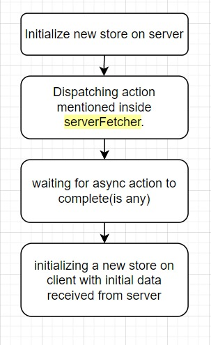

# Universal App State Management Flow

Catalyst separates route data from application-wide state. That distinction matters more in universal apps, where SSR, client navigation, and native runtime concerns all interact with the same React tree.

```text
serverFetcher/clientFetcher -> Route Data Cache -> useCurrentRouteData
                         \-> Optional Redux Store -> useSelector/useDispatch
```



## State Layers

### Route data

Use route fetchers plus `useCurrentRouteData` for data that belongs to the active page:

- page content
- detail payloads
- route-scoped filters
- server-rendered initial state

This is the default Catalyst model.

### Global state

Use Redux or another global store only for state that genuinely crosses route boundaries, such as:

- logged-in user context
- global feature flags
- cart or session-level shared state
- UI state that must survive route changes

## Why The Separation Matters

- route data should follow routing and SSR lifecycle rules
- global state should not become a second, competing page-data cache
- keeping them separate avoids stale state and duplicated fetch logic

## Guidance

- Prefer route data hooks for page-level data.
- Use Redux only for truly cross-route shared state.
- Pass shared dependencies through `fetcherArgs` when route fetchers need store access.
- Keep cache invalidation explicit when mutations affect route data.
- If `useCurrentRouteData()` returns `undefined`, check that the app is wrapped in `RouterDataProvider`.

## Universal App Considerations

In universal apps, route data can be affected by transport selection and native connectivity behavior. Keep request assumptions out of page components when possible:

- let the route data layer own initial page requests
- avoid mixing native bridge state directly into route data unless the route truly depends on it
- handle offline or degraded transport states at the shell or shared UI level

## Related Docs

- [RouterDataProvider](/content/03-Routing/03-Router-Data-Provider.md)
- [Data Fetching](/content/data-fetching)
