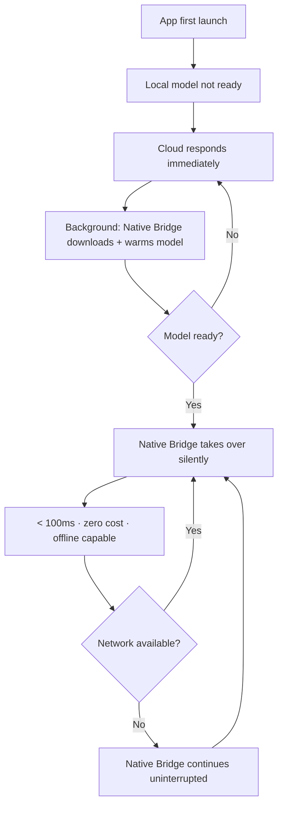
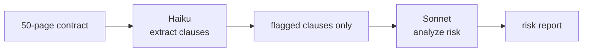
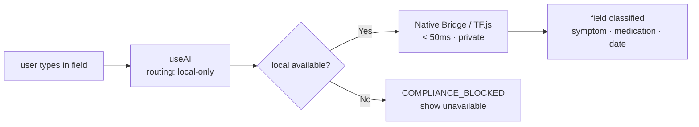
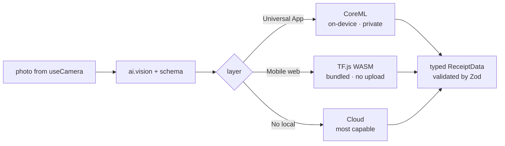
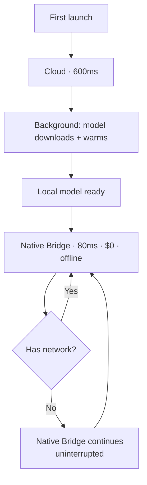

# RFC: useAI — The AI Primitive for Catalyst

**Status:** Proposal  
**Audience:** Contributors, framework users, internal team  
**Last updated:** 2026-06-09

---

## 1. The Problem

Every time you add an AI feature, you make the same decisions — regardless of team, app, or provider.

```
You want to:   summarize this document

What you actually do:
  1. Pick a provider          (OpenAI? Anthropic? Local model?)
  2. Secure the API key       (env var? server proxy? don't leak it)
  3. Wire up streaming        (SSE? WebSocket? polling?)
  4. Pipe tokens into state   (useReducer? ref? external store?)
  5. Detect the environment   (WebView? desktop browser? offline?)
  6. Write the fallback       (what if the provider is down?)
  7. Handle sessions          (stateful chat vs one-shot? when to clear?)
  8. Think about cost         (burning tokens on every keystroke?)

Then — finally — you write the summarize call.
```

Eight problems before one line of product logic. Every team. Every app. Every AI feature. From scratch.

Miss problem 5 and your app silently calls Anthropic from inside an iOS WebView with no network. Miss problem 2 and your API key ships in the bundle. Miss problem 7 and every message re-sends the full history, burning 10x the tokens.

Libraries help with pieces. Vercel AI SDK handles the streaming. LangChain handles orchestration. Transformers.js runs inference in the browser. But none of them make the decisions for you. You still wire them together. You still detect the environment. You still write the glue.

**The proposal:** `useAI` — a single hook that takes all eight problems away.

```js
const ai = useAI()
await ai.summarize(document)
```

No provider setup. No key management. No environment detection. No fallback logic. The framework handles it. You write the intent.

---

## 2. Scope

`useAI` is a Catalyst primitive. It requires Catalyst to run. If you're building on Catalyst, this is your entire AI layer.

- **Not a chat UI library.** `useAI` is a primitive. You build the chat component on top of it.
- **Not a model hosting service.** You bring your own API keys and models.
- **Not competing with LangChain.** If you need RAG, memory graphs, or tool-calling pipelines — LangChain is right for that. `useAI` is the foundation it can sit on top of.
- **Not a replacement for Vercel AI SDK in web-only non-Catalyst apps.** If you have a Next.js app, no native, no mobile — Vercel AI SDK is the right choice. This RFC is not arguing otherwise.

---

## 3. Why Not Vercel AI SDK

This is the counter-intuitive part. Vercel AI SDK is a good library. The argument isn't that it's bad — it's that it solves a different problem.

### Where Vercel is genuinely good

- Next.js RSC streaming — best in class
- Web-only apps on the Vercel platform — zero setup, mature ecosystem
- Provider adapters — well maintained, fully typed
- If you're on Vercel + Next.js + cloud-only AI → it is the right choice, full stop

### Where it breaks for Catalyst's use case

**Break 1 — It has no concept of native.**

Vercel doesn't know iOS or Android exist. There's no abstraction for CoreML, no ONNX bridge, no NPU. The moment your app is a Universal App, Vercel has nothing for the on-device layer. You'd use Vercel for cloud and hand-roll everything else — which is exactly the eight-problem list above.

**Break 2 — No environment routing.**

Vercel assumes the model is always remote. It cannot say: if mobile web → TF.js WASM in Web Worker, if desktop web → LiteRT-LM, if iOS → CoreML. That routing logic is the entire point of `useAI`. You'd have to build it yourself on top of Vercel — at which point Vercel is a thin cloud wrapper you're maintaining as a dependency.

**Break 3 — The hooks are chat-shaped.**

`useChat` and `useCompletion` are designed around conversation. They carry message arrays, they manage chat state. If you want `ai.vision()`, `ai.summarize()`, `ai.rewrite()` — capability primitives, not chat — you're fighting the abstraction. You'd rebuild the hook layer anyway.

### The provider adapter argument

Every major AI provider now speaks SSE natively:

```
Anthropic  → text/event-stream, event: content_block_delta
OpenAI     → text/event-stream, data: {"choices":[{"delta":{"content":"..."}}]}
Ollama     → newline-delimited JSON, same pattern
Gemini     → text/event-stream, similar shape
```

Each cloud adapter is ~150 lines of SSE parsing. You write `parseSSEStream(reader, onDelta, onDone, onError)` once — each adapter calls it. Owning these means you get new provider features immediately (Anthropic extended thinking, citations, tool use) without waiting for Vercel to expose them through their abstraction.

### The fundamental incompatibility

Vercel's model: your server streams from a cloud provider to a browser.

Catalyst's model: the framework decides where inference runs — device, server, or cloud — and the developer never knows which.

These aren't feature gaps. They're incompatible mental models at the root.

---

## 4. The Interface

### 4a. Basic interface

```js
const ai = useAI()

// Generate
await ai.generate("Explain this error message")

// Stream — tokens arrive live
const { stream, cancel } = ai.stream("Write a product description for...")

// Named capabilities
await ai.summarize(article, { type: 'bullets', length: 'short' })
await ai.translate(text, { from: 'en', to: 'es' })
await ai.rewrite(draft, { tone: 'formal' })
await ai.write("Onboarding email for a fintech app", { format: 'email' })

// Vision
await ai.vision(image, "Extract the total amount")

// Stateful session — context managed automatically
const ai = useAI({ sessionMode: 'stateful' })
await ai.generate("What causes inflation?")
await ai.generate("How does that affect housing prices?")  // session remembers
```

One hook. Consistent shape across every capability. No provider setup. No key management. No streaming plumbing.

### 4b. Vision

**Input types — pass anything:**

```js
await ai.vision(file, prompt)          // File from useFilePicker
await ai.vision(blob, prompt)          // Blob from useCamera
await ai.vision(base64String, prompt)  // from any source
await ai.vision(imageUrl, prompt)      // remote URL
await ai.vision([img1, img2], prompt)  // multi-image — compare, sequence, before/after
```

**Layer support:**

| Layer | Vision Support | Notes |
|---|---|---|
| Native Bridge | ✓ | CoreML Vision / LiteRT — on-device, private, fast |
| TF.js WASM | ✓ | MobileNet-class models — mobile web, lightweight |
| LiteRT-LM | ✓ | Multimodal models — desktop web |
| Server-local | ✓ | Transformers.js vision models |
| Cloud | ✓ | Claude, GPT-4o — most capable |

**Composing with Catalyst primitives:**

```js
const { photo } = useCamera()              // Catalyst primitive
const { data } = await ai.vision(photo, "Classify this defect")  // Catalyst primitive
```

Both hooks know they're on iOS. `useCamera` gives a native Blob. `ai.vision()` passes it directly to CoreML Vision — no upload, no base64 conversion, no server round-trip. Data never leaves the device. The primitives were designed to compose.

**With structured output:**

```js
import { z } from 'zod'

const ReceiptSchema = z.object({
  vendor: z.string(),
  total: z.number(),
  items: z.array(z.object({ name: z.string(), price: z.number() }))
})

const { data } = await ai.vision(receiptImage, "Extract receipt details", {
  schema: ReceiptSchema
})
// data is fully typed and guaranteed valid
// retries once with correction prompt on validation failure
// after 2 failures → error.code = 'SCHEMA_VALIDATION_FAILED'
```

### 4c. Delta as a UI primitive

Delta isn't streaming chat. It's a UI primitive that changes what interactions are possible — not just how fast they feel.

**Live document editing:**

```js
const { stream, cancel } = ai.stream("Rewrite this paragraph more concisely")

const reader = stream.getReader()
while (true) {
  const { done, value } = await reader.read()
  if (done) break
  setEditorContent(prev => prev + value.delta)  // pipes directly into editor
}
```

Without delta: 3-second spinner, then full paragraph swap. With delta: document rewrites itself character by character in real time.

**Progressive form population:**

```js
const { stream } = ai.stream("Extract all fields from this contract", {
  schema: ContractSchema
})
// each field arrives as a delta → form populates in real time
// vendor name appears, then date, then total, then clauses
// user sees data arriving — not a loading screen
```

**Parallel streams — user picks mid-stream:**

```js
const { stream: s1, cancel: cancel1 } = gpt.stream(prompt)
const { stream: s2, cancel: cancel2 } = claude.stream(prompt)

// render both side by side in real time
// user picks one mid-stream
cancel2()  // partial text preserved, no hanging request
```

### 4d. Multi-model patterns

**Pattern 1 — Race (speed)**

```js
const gpt    = useAI({ provider: 'openai' })
const claude = useAI({ provider: 'anthropic' })

const result = await Promise.race([
  gpt.generate(query),
  claude.generate(query)
])
// whoever responds first wins
```

**Pattern 2 — Consensus (quality validation)**

```js
const [gptResult, claudeResult] = await Promise.all([
  gpt.generate(legalClause),
  claude.generate(legalClause)
])

if (gptResult.data === claudeResult.data) {
  use(gptResult.data)       // two models agree → high confidence
} else {
  flagForHumanReview()      // diverge → flag
}
```

Two models as a quality gate. Not a chatbot.

**Pattern 3 — Delegated pipeline (cost + quality)**

```js
const extractor = useAI({ provider: 'anthropic', model: 'claude-haiku-4-5' })
const reasoner  = useAI({ provider: 'anthropic', model: 'claude-sonnet-4-6' })

// cheap model does the extraction
const clauses = await extractor.generate(`Extract all liability clauses: ${contract}`)

// expensive model reasons only on what matters
const risk = await reasoner.generate(`Analyze risk in these clauses: ${clauses.data}`)
```

Haiku processes the full 50-page contract. Sonnet sees only the flagged clauses. Cost is a fraction of running Sonnet on the full document. Quality is the same — or better, because Sonnet gets focused input.

### 4e. ai.clone()

`clone()` creates a new instance with overridden config. It shares the parent's session context by default — same conversation thread, different model.

```js
const ai = useAI({ provider: 'anthropic', sessionMode: 'stateful' })

await ai.generate("Summarize this contract and identify the key obligations")

// different model, same session thread
const validator = ai.clone({ provider: 'openai' })
await validator.generate("Does this summary miss any critical clauses?")
// validator sees the full conversation history
// responds from a different model's perspective
// one session, two models, coherent thread
```

Use `clone()` when you want a second opinion from a different model on the same conversation — not a new session, the same thread with a different voice.

### 4f. SSR → CSR handoff

```js
// Server — SSR
export async function getServerSideProps() {
  const ai = useAI()
  const { data: summary } = await ai.summarize(article)
  // complete response, session state serialized into page
  return { props: { summary, sessionState: ai.sessionState } }
}

// Client — same component, hydrates
const MyPage = ({ summary, sessionState }) => {
  const ai = useAI({ initialState: sessionState })
  // ai already has summary in state — no second call
  // user starts editing → same session, client now streams

  const handleEdit = () => {
    const { stream } = ai.stream("Make this shorter and more direct")
    // session context from SSR carries over seamlessly
  }
}
```

Rules:
- SSR always returns a complete response — no streaming server-side
- Client hydrates into existing state — no double call, no flash
- Streaming is client-only
- Session TTL handles stale state if the user navigates back after a long gap

### 4g. Hook lifecycle and states

Every `useAI` call moves through a state machine. Two paths depending on the layer:

```
LOCAL PATH                          CLOUD PATH
──────────────────────────────      ────────────────────────
idle                                idle
  → starting                          → starting
    → downloading (if not cached)       → streaming
      → warming                           → complete
        → streaming                        → error
          → complete
          → cancelled
          → error
```

What `progress` exposes at each state:

```js
progress.state             // current state (string)
progress.downloadProgress  // 0–100, during 'downloading'
progress.eta               // seconds remaining on download
progress.tokensGenerated   // count, during 'streaming'
progress.modelReady        // boolean — is local model available

// Example: show the right UI for each state
if (progress.state === 'downloading') {
  return <ProgressBar value={progress.downloadProgress} eta={progress.eta} />
}
if (progress.state === 'warming') {
  return <Spinner label="Almost ready..." />
}
if (progress.state === 'streaming') {
  return <StreamingText tokens={progress.tokensGenerated} />
}
```

The developer can show download UI, a spinner, a live token count — or say nothing. The framework manages the state regardless.

### 4h. Error handling

**`useAI` never throws. It always returns a typed error.**

React hooks that throw break the component tree. Every `useAI` call returns `{ data, error }`. You destructure, check, decide what to show. No try/catch in your component.

```js
const { data, error } = await ai.summarize(text)

if (error) {
  switch (error.code) {
    case 'NETWORK_ERROR':
      // retryable — show retry button
      // error.retryable = true
      break
    case 'RATE_LIMITED':
      // retryable after delay
      // error.retryAfter = seconds
      break
    case 'COMPLIANCE_BLOCKED':
      // fatal — routing: 'local-only' but no local model available
      // show "AI unavailable on this device"
      break
    case 'AUTH_ERROR':
      // fatal — never show to user, alert ops immediately
      break
  }
}
```

**Mental model — three categories:**

```
Retryable (user action)     NETWORK_ERROR, RATE_LIMITED, PROVIDER_ERROR
Fatal (dev/ops action)      AUTH_ERROR, COMPLIANCE_BLOCKED, MODEL_UNAVAILABLE, SCHEMA_VALIDATION_FAILED
Auto-handled (never seen)   CONTEXT_OVERFLOW — silently upscales to cloud
Not an error                STREAM_CANCELLED — progress.state = 'cancelled', partial text preserved
```

**Full error taxonomy:**

| Code | Retryable | Cause |
|---|---|---|
| `MODEL_UNAVAILABLE` | ✗ | No local model, no cloud configured |
| `NETWORK_ERROR` | ✓ | Lost connection mid-stream |
| `RATE_LIMITED` | ✓ after delay | Provider rate limit hit |
| `CONTEXT_OVERFLOW` | ✓ auto | Input too large — auto-upscales to cloud |
| `SCHEMA_VALIDATION_FAILED` | ✗ | Structured output failed after 2 retries |
| `COMPLIANCE_BLOCKED` | ✗ | `local-only` but no local model available |
| `PROVIDER_ERROR` | ✓ | Cloud provider returned 5xx |
| `AUTH_ERROR` | ✗ | API key missing or invalid |

---

## 5. Write Once, Run Anywhere

### 5a. One component

```js
const SummarizeButton = () => {
  const ai = useAI()
  const [summary, setSummary] = useState('')

  const handlePress = async () => {
    const { data } = await ai.summarize(document)
    setSummary(data)
  }

  return <Button onPress={handlePress} />
}
```

This component ships to iOS, Android, mobile web, and desktop web. Same file. Same hook. Same call.

### 5b. What runs underneath

```
iOS / Android (Universal App)
  → Native Bridge
  → CoreML on Neural Engine (iOS) / LiteRT on Android NPU
  → < 100ms response, zero cost, data never leaves device
  → works fully offline

Mobile web
  → TensorFlow.js WASM (bundled, 25MB)
  → runs in Web Worker — main thread never blocked
  → no download cost, no server call, instant

Desktop web (opt-in)
  → LiteRT-LM via WebGPU
  → 76 tok/s on consumer hardware, Web Worker
  → falls back to cloud if not configured

Server (SSR)
  → Cloud (Anthropic / OpenAI)
  → complete response, session serialized into page
  → client hydrates, no double call
```

The developer wrote one component. Four different things happened underneath.

### 5c. The routing arc — how it evolves



The component never changed. The routing got progressively cheaper, faster, and more private on its own.

### 5d. Native primitives compose

```js
const { photo } = useCamera()
const { data } = await ai.vision(photo, "Identify this defect and severity")
```

`useCamera` and `ai.vision()` both know they're on iOS. The photo passes directly to CoreML Vision — no upload, no format conversion, no server round-trip. Data never left the device.

With a standalone AI library you'd wire this yourself: convert the photo, decide where to send it, handle the upload, manage the response. With Catalyst you compose two hooks.

---

## 6. Use Cases

### UC1 — Delegated pipeline (Legal document review)



```js
const extractor = useAI({ provider: 'anthropic', model: 'claude-haiku-4-5' })
const reasoner  = useAI({ provider: 'anthropic', model: 'claude-sonnet-4-6' })

const { data: clauses } = await extractor.generate(
  `Extract all liability and indemnification clauses: ${contract}`
)
const { data: risk } = await reasoner.generate(
  `Analyze legal risk in these clauses. Flag anything non-standard: ${clauses}`
)
```

Haiku processes the full document cheaply. Sonnet reasons only on what matters. Cost is a fraction of running Sonnet on 50 pages. Not a chatbot — a pipeline.

---

### UC2 — Keystroke classification (Healthcare intake form)



```js
const ai = useAI({ routing: 'local-only' })

const handleChange = async (value) => {
  const { data, error } = await ai.generate(`Classify this input: ${value}`)
  if (error?.code === 'COMPLIANCE_BLOCKED') showUnavailable()
  else setFieldType(data)
}
```

Patient data never leaves the device. Classification happens in < 50ms on every keystroke. Cloud at 600ms + data leaving the device is not an option here.

---

### UC3 — Consensus validation (Legal clause generation)

```js
const gpt    = useAI({ provider: 'openai',     model: 'gpt-4o' })
const claude = useAI({ provider: 'anthropic',  model: 'claude-sonnet-4-6' })

const [gptResult, claudeResult] = await Promise.all([
  gpt.generate(`Draft a limitation of liability clause for: ${context}`),
  claude.generate(`Draft a limitation of liability clause for: ${context}`)
])

const agree = similarity(gptResult.data, claudeResult.data) > 0.85
if (agree) insertClause(gptResult.data)
else       flagForLegalReview({ gpt: gptResult.data, claude: claudeResult.data })
```

Two models generate independently. Agreement signals confidence. Divergence signals ambiguity — flag for a human. The models are a quality gate, not a chat interface.

---

### UC4 — SSR → CSR session handoff (Article editor)

```js
// Server renders the initial summary
export async function getServerSideProps() {
  const ai = useAI()
  const { data: summary } = await ai.summarize(article)
  return { props: { summary, sessionState: ai.sessionState } }
}

// Client picks up the same session — no second call
const ArticleEditor = ({ summary, sessionState }) => {
  const ai = useAI({ initialState: sessionState })
  const [content, setContent] = useState(summary)

  const refine = async () => {
    const { stream } = ai.stream("Make this more concise and direct")
    // streams into the editor, session context intact from SSR
    for await (const chunk of stream) {
      setContent(prev => prev + chunk.delta)
    }
  }
}
```

Page loads with content already rendered — SEO-friendly, instant paint. User edits. The client picks up the same session and streams refinements. No spinner, no double call, no stale state.

---

### UC5 — Cost arbitration via ops config

```mermaid
flowchart LR
    A[useAI call] --> B[/ai/config]
    B --> C{user tier}
    C -- free --> D[Ollama\nself-hosted · $0]
    C -- paid --> E[Anthropic Haiku\nfast · low cost]
    C -- power --> F[Anthropic Sonnet\nhighest quality]
```

```js
// Developer writes this — identical for all tiers
const ai = useAI()
const { data } = await ai.generate(query)
```

The routing is ops config — no code change, no deploy:

```json
// /ai/config — updated at runtime by ops
{
  "routing": {
    "free":  { "provider": "ollama",     "model": "llama3.2" },
    "paid":  { "provider": "anthropic",  "model": "claude-haiku-4-5" },
    "power": { "provider": "anthropic",  "model": "claude-sonnet-4-6" }
  }
}
```

One component. Three tiers. Ops controls the routing. No rebuild required.

---

### UC6 — Vision pipeline (Receipt → structured data)



```js
import { z } from 'zod'

const ReceiptSchema = z.object({
  vendor: z.string(),
  date: z.string(),
  total: z.number(),
  items: z.array(z.object({ name: z.string(), price: z.number() }))
})

const { photo } = useCamera()
const { data } = await ai.vision(photo, "Extract all receipt details", {
  schema: ReceiptSchema
})
// data.vendor, data.total, data.items — fully typed, guaranteed valid
```

On Universal App: CoreML processes on-device, no upload, instant. On mobile web: TF.js WASM, no server cost. Cloud only if local unavailable. The developer wrote one call regardless.

---

### UC7 — Delta as UI primitive (Live document editor)

```js
const DocumentEditor = () => {
  const ai = useAI()
  const [content, setContent] = useState(draft)
  const [streaming, setStreaming] = useState(false)

  const improve = async () => {
    setStreaming(true)
    setContent('')  // clear for rewrite

    const { stream, cancel } = ai.stream(
      `Improve this paragraph. More concise, active voice: ${draft}`
    )

    const reader = stream.getReader()
    while (true) {
      const { done, value } = await reader.read()
      if (done) break
      setContent(prev => prev + value.delta)  // live into editor
    }
    setStreaming(false)
  }
}
```

The document rewrites itself in real time. No spinner. No swap. The user watches the new version appear — they can stop it mid-stream if the direction is wrong, partial text preserved.

---

### UC8 — Offline-first field app (Site inspector)

```js
// routing: 'auto' — but local model is always available on Universal App
const ai = useAI()

const classifyDefect = async (photo, notes) => {
  const { data } = await ai.vision(photo, `Classify defect severity. Notes: ${notes}`)
  return data  // works on-site, underground, no signal — always
}
```

Construction site inspector, doctor on rounds, pilot doing pre-flight. No reliable network. The app works. CoreML runs on the Neural Engine regardless of connectivity. Cloud is never tried. `MODEL_UNAVAILABLE` only surfaces if no local model was configured — which is a config decision made at build time, not runtime.

---

### UC9 — Evolving routing arc (Universal App lifecycle)



One component. Deployed once. On day one the user gets a cloud response. By day two they get an on-device response — faster, free, offline capable. The developer shipped nothing new.

---

## 7. Production Visibility

### The state machine is observable

Every `useAI` call emits an OTel span automatically. No setup. The same state machine the hook exposes to the developer (`progress.state`) maps directly to what ops sees in their dashboard.

### Six questions OTel answers

```
"Why is TTFT spiking?"              → ai.ttft_ms histogram, split by ai.layer
"How often are we falling back?"    → ai.fallback_reason count over time
"What is this costing per tenant?"  → ai.estimated_cost sum, group by user/tenant
"Which layer is actually winning?"  → ai.layer distribution over 30 days
"Where are errors clustering?"      → ai.error_code count by type
"Is local adoption growing?"        → ai.layer='local' % week over week
```

The last question is the one that matters for "write once, run anywhere" — it tells you the routing is actually working across surfaces in production. Without it, you shipped one component and have no visibility into what ran where.

> **Note:** Set up an alert on cloud fallback rate. A spike in `ai.fallback_reason` often means local model failed to load on a device cohort — catch it before users notice.

### OTel span attributes

```
ai.layer           local | server-local | cloud
ai.provider        native | tfjs | litert | transformers-node | anthropic | openai | ollama
ai.model           claude-haiku-4-5
ai.ttft_ms         time to first token (ms)
ai.input_tokens    token count
ai.output_tokens   token count
ai.estimated_cost  USD (null for local)
ai.fallback_reason why router fell back, if it did
```

Flows into Datadog, Grafana, Honeycomb — whatever you already have.

### Sentry

`useAI` errors surface as Sentry events automatically:

```
ON_AI_ERROR              user-facing failures — breadcrumbs show what led to it
SCHEMA_VALIDATION_FAILED what prompt and schema triggered it
AUTH_ERROR               never shown to user — alert ops immediately
Cancelled streams        not errors, but worth tracking abandonment rate
```

### Usage on every response

```js
const { data, usage } = await ai.summarize(article)

usage.ttft           // ms to first token
usage.totalLatency   // ms total
usage.inputTokens    // null for local
usage.outputTokens   // null for local
usage.estimatedCost  // USD, null for local
usage.provider       // 'native' | 'tfjs' | 'anthropic' | 'openai' | 'ollama'
usage.model          // exact model string
usage.layer          // 'local' | 'server-local' | 'cloud'
```

Use `usage.layer` in your own analytics to track which surface each user is hitting. Combine with `usage.estimatedCost` to build credit systems for SaaS apps.

---

## 8. Compared To Everything Else

| Tool | Streaming | Multi-env routing | Native on-device | Vision | Multi-model | SSR/CSR continuity | Delta | Infra decisions | Web-only apps |
|---|---|---|---|---|---|---|---|---|---|
| Vercel AI SDK | ✓ | ✗ | ✗ | ✗ | ✗ | ✗ | ✓ | ✗ | ✓✓ |
| LangChain | ~ | ✗ | ✗ | ~ | ✓ | ✗ | ~ | ✗ | ~ |
| Transformers.js | ✓ | ✗ | ✗ | ✓ | ✗ | ✗ | ✓ | ✗ | ~ |
| Chrome AI | ✓ | ✗ | ✗ | ✗ | ✗ | ✗ | ✓ | ✗ | ~ |
| **Catalyst useAI** | **✓** | **✓** | **✓** | **✓** | **✓** | **✓** | **✓** | **✓** | **✓** |

**On Vercel AI SDK:** It wins on web-only apps — genuinely. If you're not on Catalyst, it's the right choice. The ✓✓ is intentional.

**On LangChain:** It handles complex multi-step pipelines, RAG, memory graphs, and tool-calling orchestration. `useAI` is not competing here — it's the foundation LangChain can sit on top of inside a Catalyst app.

**On Chrome AI (window.ai / Gemini Nano):** Real technology, not viable as a framework default. Requires 22GB free disk, >4GB VRAM, desktop Chrome only — no Android, no iOS, no WebView. Too narrow a hardware target.

The last column — infra decisions — is the one that separates them. Every other tool gives you capabilities. Catalyst makes the decisions.
